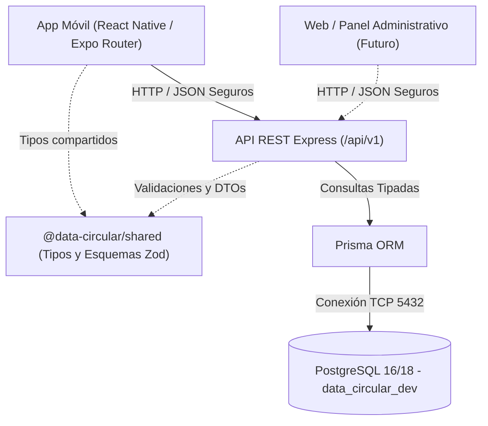

# Arquitectura del Sistema - DATA_CIRCULAR

## 1. Visión General
**DATA_CIRCULAR** es una plataforma colaborativa diseñada para el ecosistema de economía circular de la **Fundación IMARA**. Conecta generadores, recuperadores, transportadores y transformadores de materiales aprovechables.

## 2. Diagrama de Arquitectura

## 3. Estructura Monorepo
El proyecto utiliza un esquema de Monorepo basado en `npm workspaces`:
- `apps/api`: Servidor REST construido con Express, TypeScript y Prisma ORM.
- `apps/mobile`: Aplicación móvil desarrollada con Expo SDK 57 y React Native 0.86.
- `packages/shared`: Librería interna con contratos de datos, validaciones y constantes.
- `docs/`: Repositorio central de documentación técnica y manuales.

## 4. Principios Arquitectónicos
1. **Separación de Responsabilidades**: El backend modulariza controladores, servicios, repositorios y esquemas por dominio.
2. **Defensa en Profundidad**: Validación de entrada con Zod en el servidor, cabeceras seguras con Helmet, rate limiting y CORS restringido.
3. **Persistencia Transaccional y Fuerte**: Uso de PostgreSQL con integridad referencial, índices y migraciones versionadas.
4. **Documentación Exhaustiva**: Base documental para manual de usuario y manual técnico.
