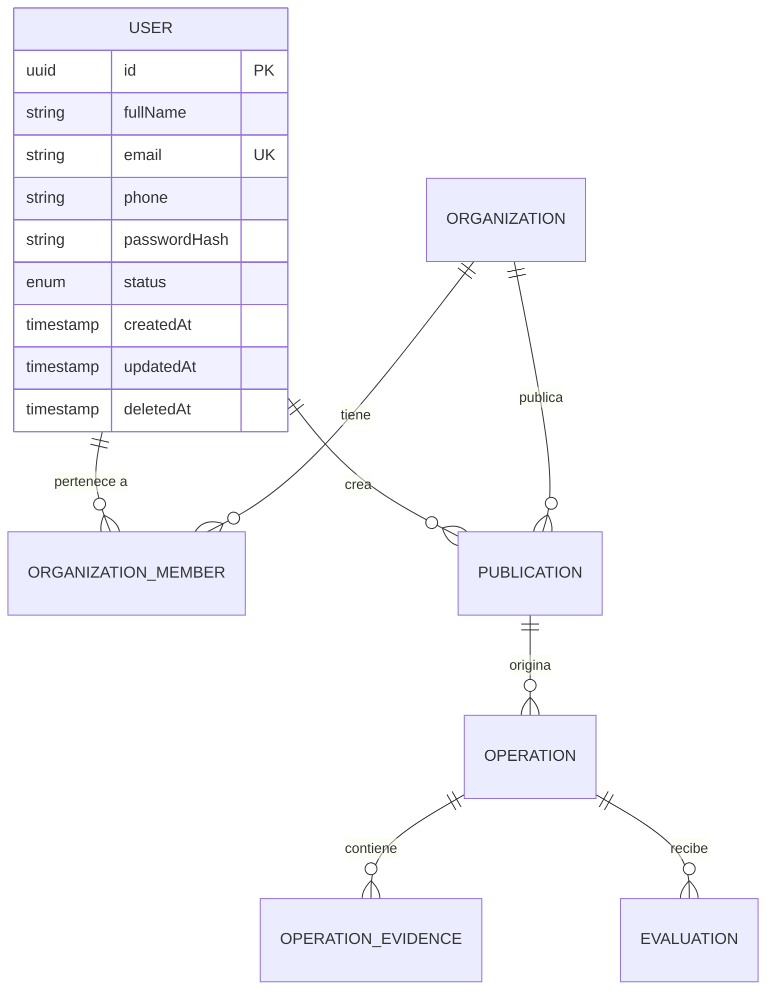

# Modelo de Datos - DATA_CIRCULAR

## 1. Estado en Fase 1
En la Fase 1 se configuró el motor de persistencia PostgreSQL y el cliente Prisma ORM.

- **Motor**: PostgreSQL 18 / 16
- **Base de datos de desarrollo**: `data_circular_dev`
- **Esquema**: `public`
- **Datasource**: Configurado mediante variable `DATABASE_URL`

## 2. Plan de Entidades para Fases Posteriores

> [!NOTE]
> En la Fase 2 se creará formalmente la entidad `User` y la primera migración versionada (`prisma migrate dev`).
